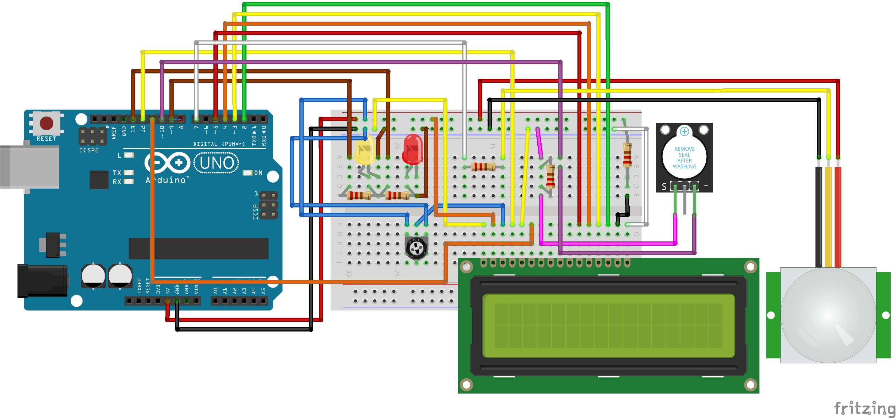

# Car Smart Security Alarm

Welcome to our's open source car security system. It can be implemented on the other places too, such as your home or your own beloved studio.

 
 

## Getting Started

Arduino Smart Car System

Group 6
Project Report

By:
Andrianus Nadaek - 183443123 
Ferick Andrew - 188763477 
Mochammad Farhan Ghiffary - 1801434733 

COMP6124 - Pervasive Computing 
Class 2016/2017 
Computer Science Program 
BINUS International 
Jakarta 

## Project Descriptions
In this project, we are going to develop Mini tech-usable module which aims to alert the users or owner if there is suspicious movement inside the car. As human being we have been always carrying stuff that makes us fulfilled throughout the day of our life whether it is our phone, laptop , grocery stuff , camera and many else that leave behind in our car. yet, sometimes, we are reckless of thinking what we have brought and forgotten as if we don’t care about them. Speaking of which, as we go through what is yet to come, we found the modules that are suitable for us.  
We are using Arduino Uno R3 which is microcontroller board. It has 14 digital input/outputs, 6 analog inputs, reset button, power jack, ICSP header and USB connection to connect the microcontroller to Arduino software where all codes will be written and uploaded it to the board towards rest of module connected with the help of breadboard as well. Furthermore, PIR sensor is set to catch detection whether there is some movement and also the role of buzzer and LED is needed to make it complete of what our project is going to be. PIR sensor will get reaction from outsider action and will make the buzzer and LED to beep after motion is done.  
However, Our main goal is to dig the issue out to user in order to keep their possessions attended safely. Occasionally, whether we are being rush or do not care about them, those stuff are potential to be robbed by anonymous person while we are out of range from our car. Moreover, nowadays, robber becomes intelligent to steal without having known by surrounding, so they can sneakily take them and calmly run away as if they are innocent people. Therefore, we believe in this pivotal unforeseen circumstance, we could reduce threats that comprehend with our purposes and modules collected. 

## Components
The components required for this project are as follows 
•	(1x) Arduino Uno R3 
•	(1x) PIR Sensor HC-SR501 
•	(1x) Buzzer Active Module KY-102 
•	(1x) LCD 1602 Blue 
•	() Jumper Male-male 
•	() Jumper Male-Female 
•	(1x) Red Light 
•	(1x) Yellow Light 
•	(5x) Resistor 100 Ohm 1/4W 
•	(1x) Trimpot/Potentiometer 10K Ohm 
•	(1x) Breadboard MB-102 830 Holes 

## How it Works?
To overcome the issue, we are going to make smart car system to notify and monitor the car if there is suspicious action happened near them. Our system will be put as hidden as possible to minimize breaches and our system’s destruction by the robber.  
HC-SR501 module will stay on input mode whilst it is not running in red mode (any motion detection). The LCD 16x2 will be used for a field monitoring, and should be hidden. Additionally we use one yellow LED and one red LED for a secondary monitoring. First the HC-SR501 or the PIR sensor module will keep tracks for any kind of movement, we also set the delay to be as minimum as possible and a medium for sensitivity. This sensor is the most important part in your system, since this will track any suspicious movement that is detecting. And to alert nearby, we are also using an active buzzer module KY-102, that supposed to beep with a short interlude. This module is not the loudest but at we don’t want to disturb peoples that is way too far from the car. All the alerts will stay on for around from at minimum 2 minutes and up to 5 minutes maximum, but for a display purpose, we will set it for only a couple of seconds. All of the components except for the sensor will be obscured.  
Couple of drawbacks is probably from the sensor itself that is not a super sensitive and fast enough yet. And the other one is the power source, our kind of IoT or pervasive systems needs power all the time, but rather than having it to be powered from the car main, we might need a bigger and a longer-lasting battery for it to stay powered on. We can choose to use the car main, but that can be wasteful. 

## Assembly / Connections
 
<b>Connect the LCD (16x2) module to the Arduino as follows:</b> 
•	Pin 1 VSS (GND) on the LCD to Ground on the Arduino 
•	Pin 2 VDD on the LCD to the 5V on the Arduino. 
•	Pin 3 VE (Contrast) on the LCD to the middle pin on the 10K potentiometer. 
•	Pin 4 RE on the LCD to digital pin 12 on the Arduino. 
•	Pin 5 R/W on the LCD to the ground of Arduino. This will put the LCD in read mode. 
•	Pin 6 Enable on the LCD to the pin 11 of Arduino. 
•	Connect the data pins (D4-D7) on the LCD to the pins 5, 4, 3, 2 on the Arduino. 
•	Pin 15 (Anode) on the LCD to the 5V pin on the Arduino through 220-ohm resistor. This is the positive pin of the backlight. 
•	Pin 16 (Cathode) on the LCD to the ground on the Arduino. This is the negative pin of the backlight. 

<b>Then we connect the 10K-ohm Potentiometer module to the Arduino as follows:</b> 
•	Left Pin (3.3V) on the Potentiometer to the 5V on the Arduino. You can also use 3V3 pin on the Arduino. 
•	Middle Pin (A2) on the Potentiometer to the Pin 3 VE (Contrast) on the LCD. 
•	Right Pin (AGND) on the Potentiometer to the Ground on the Arduino. 

<b>Afterwards we connect the HC-SR501 PIR Sensor module to the Arduino as follows:</b> 
•	Pin GND on the PIR sensor to the Ground on the Arduino 
•	Pin OUT on the PIR sensor to the pin 7 on the Arduino through 200-ohm resistor. 
•	Pin VCC on the PIR sensor to the 5V pin on the Arduino. 

<b>Next we connect the Red and Yellow LED modules to the Arduino as follows:</b> 
•	Long leg on the Red LED to the pin 13 on the Arduino through 220-ohm resistor. 
•	Long leg on the Yellow LED to the pin 9 on the Arduino through 220-ohm resistor. 
•	Short leg on both Red and Yellow LED to the Ground on the Arduino. 

<b>Finally, connect the KY-102 Active Buzzer module to the Arduino as follows:</b> 
•	Pin S (Positive) on the Buzzer to the Ground on the Arduino through 220-ohm resistor. 
•	Pin – (Negative) on the Buzzer to the pin 10 on the Arduino.
